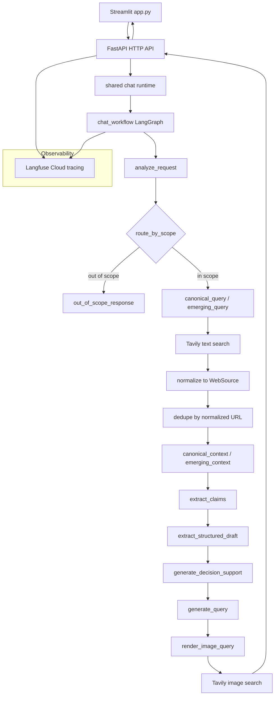

# trend-to-rule

[](https://github.com/mofuteq/trend-to-rule/actions/workflows/ci.yml)


`trend-to-rule` is a search-native Agentic RAR runtime for turning noisy trend
narratives into decision-grade rules.

In fast-moving domains, signals often split into two layers: the **canonical** —
patterns that hold across cycles — and the **emerging** — what is loud right now.
Most systems surface one side or the other. `trend-to-rule` retrieves both,
compares them, and extracts their shared structure as an inspectable rule for a
human decision-maker.

The system is not a recommender, not a forecaster, and not a styling AI. It does
not tell the user what to wear, buy, publish, or believe. It returns structured
decision-support artifacts: typed sources, extracted claims, common rules,
conflicts, gaps, tradeoffs, and visual references.

Fashion and styling are the current evaluation domain — not because the system
has any commitment to fashion as a subject, but because taste is a domain where
many people have judgments they cannot fully articulate. The gap between “this
looks right” and “I can explain why” is unusually visible in fashion, which makes
it a useful place to test whether an agent can lend articulation without taking
over the judgment.

The architecture is domain-agnostic. Wherever short-term signals can obscure
long-term structure — product strategy, content selection, capital allocation,
or other taste-driven domains — the same pattern applies.

Start with the [sample output guide](./examples/README.md) for full pipeline
runs. The examples are split by question shape: a current trend explanation,
an advice-shaped wardrobe question, and a historical evolution query.

**RAR** means **Retrieval Augmented Reasoning**: retrieval is treated as part of
the reasoning workflow rather than passive context lookup.

**Search-native** means the system uses live web search as its primary evidence
source, not a prebuilt corpus, local vector database, or fine-tuned model
knowledge.

LangGraph checkpoints are persisted to local SQLite by default at
`.data/langgraph/checkpoints.sqlite`, so the default runtime does not require a
database service.

## Output Boundary

`trend-to-rule` returns frames, not verdicts.

The final answer is written as continuous prose, but it is generated from
structured intermediate artifacts. The system reasons through claims, canonical
and emerging evidence, conflicts, gaps, tradeoffs, and common rules, then renders
without exposing that internal schema as the user-facing answer.

Every final answer must include an `Interpreted Rules` section, localized as
`解釈ルール` for Japanese output. Those rules use observation-grounded language:

> When an observable condition appears, it may signal an underlying
> interpretation.

The system should not collapse evidence into a recommendation. The human remains
the decision-maker; the agent lends a reference frame and then stops.

## Current Retrieval Backend

Tavily is the default and only text evidence backend in this repository.

The app runs two text searches per in-scope request:

- `canonical_query`
- `emerging_query`

Those queries come from `RequestAnalysis.candidate_queries`. Raw Tavily payloads
are never passed directly to the LLM. Search results are normalized into stable
`WebSource` models first:

```python
class WebSource(BaseModel):
    source_id: str
    query_kind: Literal["canonical", "emerging"]
    title: str
    url: str
    snippet: str
    published_at: str | None = None
    score: float | None = None
    provider: Literal["tavily"] = "tavily"
```

Sources are deduplicated by normalized URL, then rendered into
`canonical_context` and `emerging_context` for the existing RAR stages:

```text
retrieve_supporting_context
  -> extract_claims
  -> extract_structured_draft
  -> generate_decision_support
  -> generate_query
  -> render_image_query
  -> search_images
```

If `TAVILY_API_KEY` is missing, or if no text evidence can be retrieved, the
workflow abstains instead of producing a confident evidence-based answer.

## Visual References

Visual retrieval also uses Tavily, but it is downstream of rule generation.

The workflow does not send the final answer directly to image search. It first
converts the rule into an `ExampleQuerySpec`, renders a compact image query, and
then requests Tavily image candidates. The pipeline normalizes those candidates,
deduplicates image URLs and page/title pairs, and selects the top candidates in
Tavily-provided order.

Visual references are optional supporting examples, not the core reasoning
source. No local embedding model is required for the default runtime.

## Architecture




The FastAPI boundary is implemented in [`src/api.py`](./src/api.py). It owns
chat execution, chat loading, chat listing, chat deletion, chat turn numbering,
durable chat history and metadata updates, title generation, workspace chat-id
updates, and the call into the shared chat runtime.

Streamlit is intentionally treated as a replaceable UI surface. It renders chat
history, visual references, and evidence tables, but the agent runtime and
persisted execution state live behind the FastAPI boundary.

The LangGraph workflow is implemented in
[`src/services/chat_workflow.py`](./src/services/chat_workflow.py). It keeps
request analysis, scope routing, the out-of-scope path, the structured RAR
stages, visual retrieval, Langfuse tracing, and the SQLite checkpoint backend.

In-scope runs log text evidence metadata to Langfuse:

- `text_retrieval_backend="tavily"`
- `canonical_source_count`
- `emerging_source_count`
- `total_source_count`


Out-of-scope requests do not run `retrieve_supporting_context` and do not call
Tavily text search.

## Runtime Resilience

A useful agent should not only answer; it should survive interruption.

Each chat turn uses a deterministic LangGraph `thread_id` based on the chat id
and turn number. FastAPI persists workflow run metadata for every turn,
including whether the run is `running`, `completed`, or `failed`. LangGraph
persists node-level checkpoints to SQLite, so an unfinished workflow can resume
from the saved checkpoint by reusing the same `thread_id`.

If the browser is closed or the Streamlit UI is reopened while a workflow is
unfinished, the UI can discover the unfinished run through the chat API and
automatically resume it. The resume path is execution control, not trace
inspection: FastAPI stores run metadata and exposes the resume endpoint,
LangGraph stores checkpointed workflow state, Streamlit remains a replaceable UI
surface, and Langfuse remains responsible for inspecting what happened.

Resume is node-level. If a node failed before its checkpoint was saved, that
node may be retried; completed checkpointed nodes can be skipped by the resumed
workflow.

## Directory Layout

```text
trend-to-rule/
├── examples/
├── src/
│   ├── app.py
│   ├── Dockerfile
│   ├── core/
│   ├── pipeline/
│   ├── prompt_template/
│   ├── services/
│   ├── storage/
│   └── ui/
├── pyproject.toml
├── uv.lock
└── README.md
```

- `examples/`: full pipeline sample outputs, with an index for the recommended
  reading path.
- `src/core/`: runtime config, domain models, text/query helpers.
- `src/services/web_search.py`: Tavily text evidence search and `WebSource`
  normalization.
- `src/services/image_search.py`: Tavily image search, candidate normalization,
  deduplication, and top-candidate selection.
- `src/services/chat_workflow.py`: LangGraph workflow orchestration.
- `src/services/chat.py`: LLM-backed request analysis, claim extraction,
  structured draft, decision support, and query generation.
- `src/prompt_template/`: prompts for each structured stage.
- `src/storage/`: LMDB-backed chat persistence.
- `src/ui/`: Streamlit rendering and session state.

## Environment Setup

Install dependencies with:

```bash
uv sync
```

Create `src/.env` for local and Docker runs.

The app uses Pydantic AI with OpenRouter-specific provider/model classes at the
LLM boundary. The workflow architecture remains provider-independent, but the
runtime does not treat OpenAI-compatible APIs as the architectural contract.

Set the OpenRouter fields together: `OPENROUTER_MODEL`, `OPENROUTER_API_KEY`,
`OPENROUTER_OUTPUT_RETRIES`, and `OPENROUTER_REASONING_EFFORT`.

Use the model id from OpenRouter, such as `google/gemini-3-flash-preview` or
`nvidia/nemotron-3-super-120b-a12b:free`. Do not include the LiteLLM-style
`openrouter/` prefix.

```dotenv
OPENROUTER_MODEL=google/gemini-3-flash-preview
OPENROUTER_API_KEY=
OPENROUTER_OUTPUT_RETRIES=3
OPENROUTER_REASONING_EFFORT=low

TAVILY_API_KEY=
TAVILY_TEXT_MAX_RESULTS=5
TAVILY_SEARCH_DEPTH=basic
TAVILY_INCLUDE_RAW_CONTENT=false
TAVILY_IMAGE_FETCH_LIMIT=10
TAVILY_IMAGE_LIMIT=3
TAVILY_INCLUDE_IMAGE_DESCRIPTIONS=true

CHAT_DB_PATH=.data/chat_db
T2R_DEFAULT_WORKSPACE=demo
T2R_API_BASE_URL=http://localhost:8000
APP_LOG_LEVEL=INFO
APP_ENV=development

LANGFUSE_BASE_URL="https://cloud.langfuse.com"
LANGFUSE_PUBLIC_KEY=
LANGFUSE_SECRET_KEY=

LANGGRAPH_SQLITE_PATH=.data/langgraph/checkpoints.sqlite
```

Key settings:

- `OPENROUTER_MODEL`: OpenRouter model identifier, e.g.
  `google/gemini-3-flash-preview` or
  `nvidia/nemotron-3-super-120b-a12b:free`.
- `OPENROUTER_API_KEY`: required OpenRouter API key.
- `OPENROUTER_OUTPUT_RETRIES`: maximum structured-output validation retries
  before Pydantic AI raises a model-behavior error. Default: `3`.
- `OPENROUTER_REASONING_EFFORT`: OpenRouter reasoning effort passed through
  `openrouter_reasoning`. One of `minimal`, `low`, `medium`, `high`, `xhigh`.
  Default: `low`.
- `TAVILY_API_KEY`: required for in-scope text evidence retrieval and also used
  by visual retrieval.
- `TAVILY_TEXT_MAX_RESULTS`: per-lane text result cap. Default: `5`.
- `TAVILY_SEARCH_DEPTH`: Tavily search depth. Default: `basic`.
- `TAVILY_INCLUDE_RAW_CONTENT`: whether Tavily may return raw page content.
  Default: `false`.
- `TAVILY_IMAGE_FETCH_LIMIT`: raw image candidate count requested from Tavily.
- `TAVILY_IMAGE_LIMIT`: final visual reference card count selected from Tavily
  results.
- `TAVILY_INCLUDE_IMAGE_DESCRIPTIONS`: whether Tavily should return image
  descriptions when available.
- `LANGFUSE_BASE_URL`: defaults to Langfuse Cloud.
- `LANGFUSE_PUBLIC_KEY` / `LANGFUSE_SECRET_KEY`: tracing is disabled if either
  key is empty.
- `LANGGRAPH_SQLITE_PATH`: local SQLite file for LangGraph checkpoints.
  Default: `.data/langgraph/checkpoints.sqlite`.
- `T2R_API_BASE_URL`: FastAPI backend URL used by the Streamlit UI.
  Default: `http://localhost:8000`.

## Run Locally


FastAPI owns chat execution and persisted chat management: workflow invocation,
chat loading, chat listing, chat deletion, turn numbering, chat history,
workflow run metadata, `last_request_goal`, title generation, and workspace
chat-id updates. Streamlit is a UI client for chat rendering and user
interaction. The backend process uses the same local `.data/` storage paths
configured in `src/.env`.

Terminal 1: launch the FastAPI backend with uvicorn:

```bash
uv run uvicorn src.api:app --reload --host 0.0.0.0 --port 8000
```

Terminal 2: launch the Streamlit UI against that backend:

```bash
T2R_API_BASE_URL=http://localhost:8000 uv run streamlit run src/app.py
```

Streaming, authentication, job queues, and Docker Compose remain outside the
current runtime boundary.

## Run With Docker

Run the local two-container setup with the helper script:

```bash
scripts/run-local-containers.sh start
```

The script builds one shared Docker image and starts two containers from it:

- `trend-to-rule-api`: FastAPI on `http://localhost:8000`
- `trend-to-rule-ui`: Streamlit on `http://localhost:8501`

The FastAPI container owns chat execution and persisted chat management. It
mounts the local `.data/` directory at `/app/.data`. The Streamlit container is
started with `T2R_API_BASE_URL=http://trend-to-rule-api:8000` and stays a UI
client.

Useful commands:

```bash
scripts/run-local-containers.sh status
scripts/run-local-containers.sh logs
scripts/run-local-containers.sh stop
```

Override ports when needed:

```bash
T2R_API_PORT=18000 T2R_UI_PORT=18501 scripts/run-local-containers.sh start
```

## Observability


`trend-to-rule` uses Langfuse Cloud as the default observability backend for
development and OSS demos. Set `LANGFUSE_BASE_URL=https://cloud.langfuse.com`
with a Langfuse Cloud public/secret key pair in `src/.env`; tracing activates
automatically when both keys are present.

Each FastAPI chat turn is captured as a single `chat_turn` trace with native
LangGraph callback events. In-scope requests show `analyze_request`,
`route_by_scope`, `retrieve_supporting_context`, and the RAR nodes.
Out-of-scope requests show `analyze_request`, `route_by_scope`, and
`out_of_scope_response`.

LLM calls in `src/services/llm_client.py` are recorded as generation spans with
backend, model name, input messages, output, token usage, sampling config,
reasoning effort, and structured-output retry metadata.

See [docs/langfuse.md](./docs/langfuse.md) for the current observability setup.

## License

This project is licensed under the MIT License.
