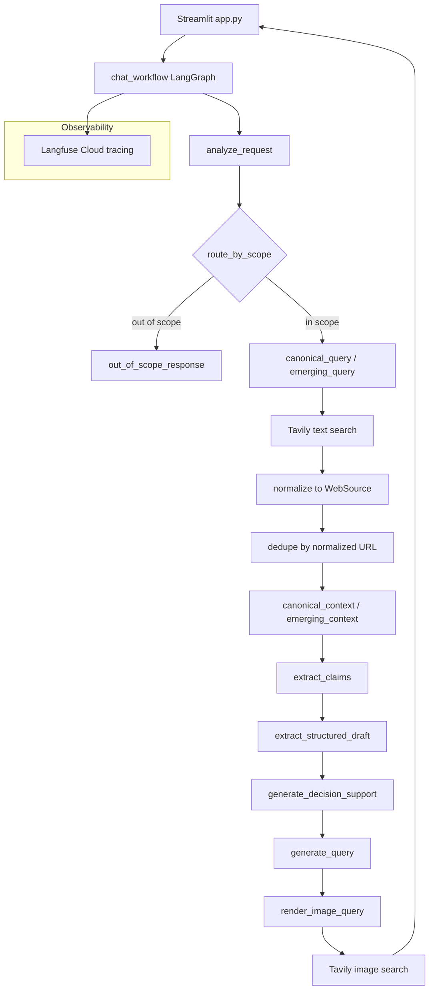

# trend-to-rule

[](https://github.com/mofuteq/trend-to-rule/actions/workflows/ci.yml)


`trend-to-rule` is a search-native Agentic RAR runtime for turning noisy fashion
and styling trend narratives into inspectable rules.

It separates canonical patterns from emerging signals, extracts structured
claims from normalized web evidence, synthesizes a rule, and optionally attaches
visual references. The final answer is backed by explicit intermediate
artifacts rather than hidden model grounding.

LangGraph checkpoints are persisted to local SQLite by default at
`.data/langgraph/checkpoints.sqlite`, so the default runtime does not require a
database service.

## Current Retrieval Backend

Tavily is the default and only text evidence backend in this repository.

The app runs two text searches per in-scope request:

- `canonical_query`
- `emerging_query`

Those queries come from `RequestAnalysis.candidate_queries`. Raw Tavily payloads
are never passed directly to the LLM. Search results are normalized into stable
`WebSource` models first:

```python
class WebSource(BaseModel):
    source_id: str
    query_kind: Literal["canonical", "emerging"]
    title: str
    url: str
    snippet: str
    published_at: str | None = None
    score: float | None = None
    provider: Literal["tavily"] = "tavily"
```

Sources are deduplicated by normalized URL, then rendered into
`canonical_context` and `emerging_context` for the existing RAR stages:

```text
retrieve_supporting_context
  -> extract_claims
  -> extract_structured_draft
  -> generate_decision_support
  -> generate_query
  -> render_image_query
  -> search_images
```

If `TAVILY_API_KEY` is missing, or if no text evidence can be retrieved, the
workflow abstains instead of producing a confident evidence-based answer.

## Visual References

Visual retrieval also uses Tavily, but it is downstream of rule generation.

The workflow does not send the final answer directly to image search. It first
converts the rule into an `ExampleQuerySpec`, renders a compact image query, and
then requests Tavily image candidates. RepoA normalizes those candidates,
deduplicates image URLs and page/title pairs, and selects the top candidates in
Tavily-provided order.

Visual references are optional supporting examples, not the core reasoning
source. No local embedding model is required for the default runtime.

## Architecture



The LangGraph workflow is implemented in
[`src/services/chat_workflow.py`](./src/services/chat_workflow.py). It keeps
request analysis, scope routing, the out-of-scope path, the structured RAR
stages, visual retrieval, Langfuse tracing, and the SQLite checkpoint backend.

In-scope runs log text evidence metadata to Langfuse:

- `text_retrieval_backend="tavily"`
- `canonical_source_count`
- `emerging_source_count`
- `total_source_count`

Out-of-scope requests do not run `retrieve_supporting_context` and do not call
Tavily text search.

## Directory Layout

```text
trend-to-rule/
├── docker-compose.yml
├── src/
│   ├── app.py
│   ├── Dockerfile
│   ├── core/
│   ├── pipeline/
│   ├── prompt_template/
│   ├── services/
│   ├── storage/
│   └── ui/
├── pyproject.toml
├── uv.lock
└── README.md
```

- `src/core/`: runtime config, domain models, text/query helpers.
- `src/services/web_search.py`: Tavily text evidence search and `WebSource`
  normalization.
- `src/services/image_search.py`: Tavily image search, candidate normalization,
  deduplication, and top-candidate selection.
- `src/services/chat_workflow.py`: LangGraph workflow orchestration.
- `src/services/chat.py`: LLM-backed request analysis, claim extraction,
  structured draft, decision support, and query generation.
- `src/prompt_template/`: prompts for each structured stage.
- `src/storage/`: LMDB-backed chat persistence.
- `src/ui/`: Streamlit rendering and session state.
- `docker-compose.yml`: local app runtime.

## Environment Setup

Install dependencies with:

```bash
uv sync
```

Create `src/.env` for local runs and Docker Compose `env_file`.

The app uses Pydantic AI with an OpenAI-compatible provider client. OpenRouter
is the default example provider, so set all three LLM fields together:
`LLM_MODEL`, `LLM_API_KEY`, and `LLM_BASE_URL`.

For OpenRouter, use the model id from OpenRouter, such as
`google/gemini-3-flash-preview` or
`nvidia/nemotron-3-super-120b-a12b:free`, and set
`LLM_BASE_URL=https://openrouter.ai/api/v1`. Do not include the LiteLLM-style
`openrouter/` prefix when using the OpenRouter base URL directly.

```dotenv
LLM_MODEL=google/gemini-3-flash-preview
LLM_API_KEY=
LLM_BASE_URL=https://openrouter.ai/api/v1
LLM_OUTPUT_RETRIES=3
LLM_REASONING_EFFORT=low

TAVILY_API_KEY=
TAVILY_TEXT_MAX_RESULTS=5
TAVILY_SEARCH_DEPTH=basic
TAVILY_INCLUDE_RAW_CONTENT=false
TAVILY_IMAGE_FETCH_LIMIT=10
TAVILY_IMAGE_LIMIT=3
TAVILY_INCLUDE_IMAGE_DESCRIPTIONS=true

CHAT_DB_PATH=.data/chat_db
T2R_DEFAULT_WORKSPACE=demo
APP_LOG_LEVEL=INFO
APP_ENV=development

LANGFUSE_BASE_URL="https://cloud.langfuse.com"
LANGFUSE_PUBLIC_KEY=
LANGFUSE_SECRET_KEY=

LANGGRAPH_SQLITE_PATH=.data/langgraph/checkpoints.sqlite
```

Key settings:

- `LLM_MODEL`: model identifier for the configured OpenAI-compatible endpoint,
  e.g. `google/gemini-3-flash-preview` or
  `nvidia/nemotron-3-super-120b-a12b:free` for OpenRouter.
- `LLM_API_KEY`: required API key for the selected backend.
- `LLM_BASE_URL`: required for OpenRouter and any non-OpenAI backend that
  exposes an OpenAI-compatible API. Use `https://openrouter.ai/api/v1` for
  OpenRouter.
- `LLM_OUTPUT_RETRIES`: maximum structured-output validation retries before
  Pydantic AI raises a model-behavior error. Default: `3`.
- `LLM_REASONING_EFFORT`: controls Pydantic AI's unified `thinking` model
  setting. One of `minimal`, `low`, `medium`, `high`, `xhigh`. Default:
  `low`.
- `TAVILY_API_KEY`: required for in-scope text evidence retrieval and also used
  by visual retrieval.
- `TAVILY_TEXT_MAX_RESULTS`: per-lane text result cap. Default: `5`.
- `TAVILY_SEARCH_DEPTH`: Tavily search depth. Default: `basic`.
- `TAVILY_INCLUDE_RAW_CONTENT`: whether Tavily may return raw page content.
  Default: `false`.
- `TAVILY_IMAGE_FETCH_LIMIT`: raw image candidate count requested from Tavily.
- `TAVILY_IMAGE_LIMIT`: final visual reference card count selected from Tavily
  results.
- `TAVILY_INCLUDE_IMAGE_DESCRIPTIONS`: whether Tavily should return image
  descriptions when available.
- `LANGFUSE_BASE_URL`: defaults to Langfuse Cloud.
- `LANGFUSE_PUBLIC_KEY` / `LANGFUSE_SECRET_KEY`: tracing is disabled if either
  key is empty.
- `LANGGRAPH_SQLITE_PATH`: local SQLite file for LangGraph checkpoints.
  Default: `.data/langgraph/checkpoints.sqlite`.

## Run With Docker Compose

Start the Streamlit app:

```bash
docker compose up -d
```

Services:

- Streamlit app: `http://localhost:8501`

Stop services:

```bash
docker compose down
```

Compose details:

- The app image is built from [`src/Dockerfile`](./src/Dockerfile).
- Environment variables are loaded from `src/.env`.
- Runtime data is mounted from `.data/` into the container at `/app/.data`.
- LangGraph checkpoints are stored in `.data/langgraph/checkpoints.sqlite` by
  default.

## Run Locally

Launch the Streamlit app with:

```bash
uv run streamlit run src/app.py
```

## Observability

RepoA uses Langfuse Cloud as the default observability backend for development
and OSS demos. Set `LANGFUSE_BASE_URL="https://cloud.langfuse.com"` with a
Langfuse Cloud public/secret key pair in `src/.env`; tracing activates
automatically when both keys are present.

Each Streamlit chat turn is captured as a single `chat_turn` trace with native
LangGraph callback events. In-scope requests show `analyze_request`,
`route_by_scope`, `retrieve_supporting_context`, and the RAR nodes.
Out-of-scope requests show `analyze_request`, `route_by_scope`, and
`out_of_scope_response`.

LLM calls in `src/services/llm_client.py` are recorded as generation spans with
model name, input messages, output, token usage, and sampling config.

See [docs/langfuse.md](./docs/langfuse.md) for the current observability setup.

## License

This project is licensed under the MIT License.
