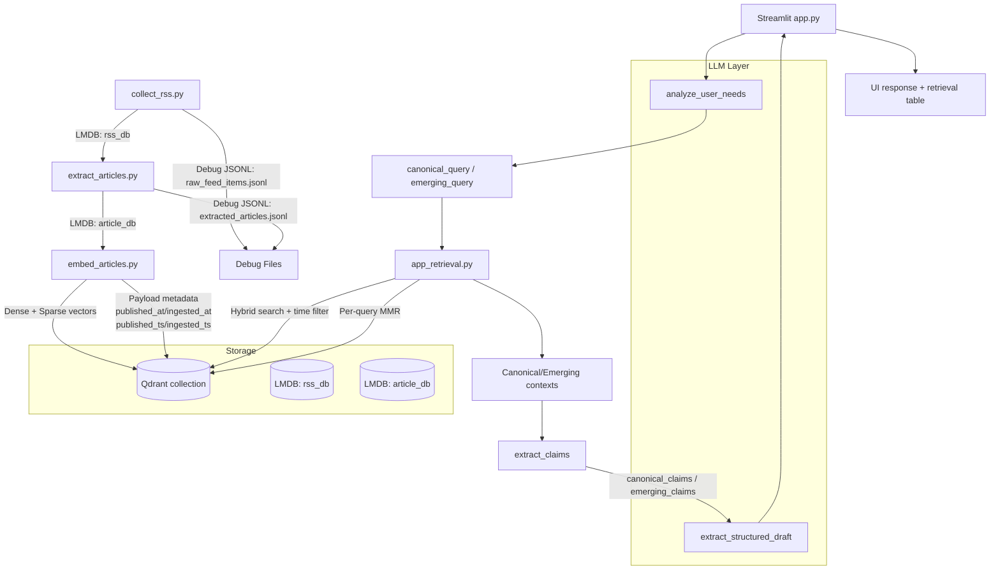

# trend-to-rule

Structural trend distillation engine that separates canonical patterns from emerging signals across multi-source articles.

---

## Overview

trend-to-rule is a structural reasoning system that converts noisy multi-source trend narratives into reusable decision rules.

Instead of summarizing retrieved documents, the system separates canonical patterns from emerging signals and synthesizes higher‑level rules that explain how trends evolve.

It ingests multi-source articles, performs structured retrieval, separates stable (canonical) patterns from emerging signals, and outputs reusable design rules in a deterministic JSON schema.

The system performs claim-level extraction before structural synthesis so that reasoning operates on structured signals rather than raw article chunks.

trend-to-rule is not an LLM-centric agent.
Rather than delegating end-to-end decision-making to the model, it enforces an explicit reasoning pipeline in which LLMs operate as controlled transformation components inside a human-designed system.
The final decision remains with the user.

This is not a knowledge retrieval tool.
This is not a summarizer.

The system operates as a staged pipeline:
```
collect → extract → embed → retrieval → claim extraction → structural synthesis → rule generation
```
The goal is structural distillation: transforming noisy trend narratives into reusable reasoning artifacts.

The core idea is that retrieval itself becomes a reasoning primitive.

The goal is to model how humans derive rules from observed trends.

Sample output:

- [examples/sample-output.md](./examples/sample-output.md)

---

## Architecture

The following diagram shows the end-to-end pipeline from RSS ingestion to rule synthesis.

The pipeline consists of the following stages:

1. RSS collection
2. Article extraction
3. Embedding generation
4. Hybrid retrieval (dense + sparse)
5. Canonical vs Emerging separation
6. Claim extraction
7. Structural synthesis
8. Rule generation

Each stage produces explicit intermediate artifacts so the reasoning process remains reproducible and inspectable.



## Directory Layout

The codebase is organized to mirror the pipeline described above.

```text
trend-to-rule/
├── .data/
│   ├── rss_db/
│   ├── article_db/
│   ├── chat_db/
│   └── qdrant_data/
├── src/
│   ├── app.py
│   ├── core/
│   │   ├── models.py
│   │   ├── template_utils.py
│   │   └── text_utils.py
│   ├── pipeline/
│   │   ├── collect_rss.py
│   │   ├── extract_articles.py
│   │   └── embed_articles.py
│   ├── prompt_template/
│   │   ├── extract_structured_draft.j2
│   │   ├── generate_decision_support.j2
│   │   ├── generate_search_query.j2
│   │   ├── infer_attribute.j2
│   │   └── user_needs.j2
│   ├── retrieval/
│   │   ├── app_retrieval.py
│   │   └── search_vectors.py
│   ├── services/
│   │   └── chat.py
│   ├── storage/
│   │   ├── chat_db.py
│   │   └── lmdb_utils.py
│   └── ui/
│       ├── app_sidebar.py
│       └── app_state.py
├── pyproject.toml
└── README.md
```

Directory responsibilities:

- `.data/`: Local runtime artifacts such as LMDB files, Qdrant data, and debug outputs.
- `src/core/`: Shared domain models and reusable text/template utilities.
- `src/pipeline/`: Offline ingestion pipeline stages from RSS collection to embedding generation.
- `src/prompt_template/`: Prompt templates used by LLM-driven analysis and synthesis steps.
- `src/retrieval/`: Hybrid vector retrieval and canonical/emerging query orchestration.
- `src/services/`: LLM integration layer responsible for model routing and request handling.
- `src/storage/`: Persistence helpers for LMDB-backed storage.
- `src/ui/`: Streamlit UI state and sidebar wiring.
- `src/app.py`: Streamlit application entrypoint.

---
## Motivation

Large Language Models generate plausible summaries, but they often:

- Blur time-series evolution
- Average conflicting viewpoints
- Fail to distinguish stable structure from transient hype
- Lack explicit epistemic boundary control

`trend-to-rule` addresses these limitations by enforcing:

- Explicit canonical vs emerging separation
- Cross-source structural synthesis
- Deterministic output schema
- Reproducible intermediate stages

---

## Environment Setup (uv)

Install dependencies with:

```bash
uv sync
```

## `.env` Configuration

Create `src/.env` for local runs and Docker Compose `env_file`.

Typical example:

```dotenv
GEMINI_API_KEY=your-gemini-api-key
OPENAI_API_KEY=your-openai-compatible-api-key
OPENAI_BASE_URL=http://localhost:11434/v1
OPENAI_MODEL=gemma3:12b
OPENAI_REASONING_EFFORT=low

VECTOR_QDRANT_URL=http://localhost:6333
VECTOR_QDRANT_PATH=
VECTOR_COLLECTION=article_markdown_bge_m3
VECTOR_MODEL_NAME=BAAI/bge-m3
VECTOR_DEVICE=auto
VECTOR_CANDIDATE_K=50
VECTOR_PER_QUERY_TOP_K=5
VECTOR_MMR_DIVERSITY=0.3

CHAT_DB_PATH=.data/chat_db
APP_LOG_LEVEL=INFO
```

Notes:

- `GEMINI_API_KEY`: Used when `services/chat.py` routes requests to Gemini.
- `OPENAI_API_KEY`: Used for OpenAI-compatible endpoints. For some local backends, a dummy value is acceptable.
- `OPENAI_BASE_URL`: Default OpenAI-compatible endpoint. Example: Ollama at `http://localhost:11434/v1`.
- `OPENAI_MODEL`: Default non-Gemini model name.
- `OPENAI_REASONING_EFFORT`: Default reasoning level for non-Gemini models. Supported values are `low`, `medium`, and `high`.
- `VECTOR_QDRANT_URL`: Qdrant endpoint used by the Streamlit app when `VECTOR_QDRANT_PATH` is empty.
- `VECTOR_QDRANT_PATH`: Optional filesystem path for local embedded Qdrant. Leave empty to use `VECTOR_QDRANT_URL`.
- `CHAT_DB_PATH`: LMDB path for chat history and session metadata.
- `APP_LOG_LEVEL`: Application log level such as `INFO` or `DEBUG`.

## Run Qdrant With Docker Compose

If you want to run the Streamlit app and Qdrant in containers, start them with the bundled Compose file:

```bash
docker compose up -d
```

Services will be available at:

- Streamlit app: `http://localhost:8501`
- `http://localhost:6333`

To stop it:

```bash
docker compose down
```

Compose details:

- The app image is built from [`src/Dockerfile`](./src/Dockerfile) using `debian:stable-slim`.
- The app is started with `uv run streamlit run src/app.py`.
- The app connects to Qdrant over the Compose network using `http://qdrant:6333`.
- Local runtime data is mounted from `.data/` into the container at `/app/.data`.
- Environment variables are loaded from `src/.env` via `env_file`.

Qdrant storage remains persisted in the Docker volume `qdrant_data`.

---

## collect_rss.py Usage

`collect_rss.py` fetches Google News RSS items for predefined queries and stores normalized records into LMDB + debug JSONL.

### Run

```bash
uv run src/pipeline/collect_rss.py
```

### Resume after interruption

If the process stops due to transient network errors (for example `ConnectionResetError`), resume from the last completed task:

```bash
uv run src/pipeline/collect_rss.py --resume
```

To restart from scratch and clear checkpoint:

```bash
uv run src/pipeline/collect_rss.py --reset-checkpoint
```

### Output

- LMDB: `.data/rss_db`
- Debug JSONL: `.data/raw_feed_items.jsonl`
- Checkpoint: `.data/collect_rss_checkpoint.json`

### Notes

- Current query list and per-query fetch size (`n=50`) are defined in code (`main()`).
- Records are deduplicated by `dedupe_key` when writing to LMDB.
- Checkpoint is updated after each successful task; `--resume` skips tasks up to the saved index.
- You can override checkpoint path with `--checkpoint-path`.

---

## extract_articles.py Usage

`extract_articles.py` reads RSS records from LMDB, resolves article pages, converts article body to Markdown, and writes results to LMDB + debug JSONL.

### Run

```bash
uv run src/pipeline/extract_articles.py
```

### Typical example

```bash
uv run src/pipeline/extract_articles.py \
  --input-lmdb .data/rss_db \
  --output-lmdb .data/article_db \
  --debug-jsonl .data/extracted_articles.jsonl \
  --interval 1.5
```

### Main options

- `--input-lmdb`: Input RSS LMDB path (default: `.data/rss_db`)
- `--output-lmdb`: Output extracted LMDB path (default: `.data/article_db`)
- `--debug-jsonl`: Debug JSONL append path (default: `.data/extracted_articles.jsonl`)
- `--limit`: Max records to process (`0` means all)
- `--interval`: Sleep seconds per record request
- `--no-readability`: Disable readability-based extraction
- `--only-new`: Skip records whose `dedupe_key` already exists in output LMDB

### Notes

- Output Markdown includes frontmatter metadata (e.g. `source_url`, `resolved_url`, `published_at`, `locale`, `country`, `word_count`, `section_count`).
- LMDB and JSONL are written per record.

---

## embed_articles.py Usage

`embed_articles.py` reads extracted article markdown from LMDB, creates dense+sparse embeddings with `bge-m3`, and upserts chunk vectors into Qdrant.

### Run

```bash
uv run src/pipeline/embed_articles.py
```

### Example: Docker Compose Qdrant

```bash
uv run src/pipeline/embed_articles.py \
  --input-lmdb .data/article_db \
  --collection article_markdown_bge_m3 \
  --qdrant-url http://localhost:6333 \
  --batch-size 32 \
  --device auto \
  --interval 0.5 \
  --recreate
```

### Example: Local Qdrant path

```bash
uv run src/pipeline/embed_articles.py \
  --input-lmdb .data/article_db \
  --collection article_markdown_bge_m3 \
  --qdrant-path .data/qdrant_data \
  --batch-size 32 \
  --device auto \
  --interval 0.5 \
  --recreate
```

### Main options

- `--input-lmdb`: Input extracted LMDB path (default: `.data/article_db`)
- `--qdrant-path`: Local persistent Qdrant path (prioritized over `--qdrant-url`)
- `--qdrant-url`: Qdrant endpoint URL (default: `http://localhost:6333`)
- `--qdrant-api-key`: Qdrant API key
- `--collection`: Target Qdrant collection name
- `--model-name`: Embedding model name (default: `BAAI/bge-m3`)
- `--batch-size`: Embedding batch size
- `--limit`: Max records to process (`0` means all)
- `--interval`: Sleep seconds between each record processing
- `--recreate`: Drop and recreate collection before ingest
- `--only-new`: Embed only chunks not already present in Qdrant
- `--update-payload-only`: Update payload only (no re-embedding, no vector overwrite)


### Notes

- Use `--qdrant-url http://localhost:6333` when running Qdrant via Docker Compose.
- Use `--qdrant-path .data/qdrant_data` for local filesystem persistence.
- `--qdrant-path` must be a local directory path.
- Payload includes metadata such as `published_ts` and `ingested_ts` (Unix time).

---

## app.py Usage

Launch the Streamlit app with:

```bash
uv run streamlit run src/app.py
```

---

## Retrieval Design Matters: A Comparison

This section demonstrates how retrieval strategy fundamentally changes output quality.

We compare two approaches:

1. **Baseline Retrieval** – Direct vector search using the raw user prompt.
2. **Structured Retrieval** – Separate hybrid searches for canonical and emerging patterns.

### 1) Baseline: User Prompt -> Vector Search -> Synthesis

**User Prompt**
> "Tell me about fashion trends in Silicon Valley."

#### Retrieval Strategy

- Single vector query using the raw user prompt.
- Hybrid search (dense + sparse) + MMR
- Top-N results passed directly to synthesis.

#### Observed Output Characteristics

- Blends historical norms and recent shifts together.
- Tends toward summarization rather than structural separation.
- Canonical and emerging patterns are often mixed.
- Conflicts are averaged out instead of exposed.
- Output resembles a blog-style overview.

#### Example Pattern

- "Minimalist tech uniforms"
- "Vintage denim replacing chinos"
- "Quiet luxury trend"

These elements are described together without clear temporal or structural distinction.

#### Limitation

The model performs a semantic average over retrieved content.  
No explicit separation of time, dominance, or structural shift occurs.

**Result:** Readable, but structurally weak.

### 2) Structured Retrieval: Canonical vs Emerging Separation

Instead of retrieving with the raw user prompt:

1. Generate two structurally distinct queries:
   - `canonical_query`
   - `emerging_query`
2. Perform hybrid search independently for each.
   - `emerging`: `published_ts >= now - 180d`
   - `canonical`: `published_ts < now - 180d`
3. Apply MMR within each result set.
4. Keep canonical and emerging result sets independent for synthesis context.

#### Canonical Query (Example)
`tech industry dress code evolution Bay Area professional norms`

#### Emerging Query (Example)
`Bay Area workplace style shift 2024 adoption signaling changes`

#### Observed Output Characteristics

- Canonical contains **pre-shift baseline patterns**:
  - Minimalist tech uniform
  - Normcore aesthetic
  - Traditional office wear (chinos, dress trousers)
- Emerging contains **post-shift change signals**:
  - Vintage denim normalization
  - Quiet luxury among tech elites
  - Generational silhouette shifts
- Conflicts are explicit:
  - Minimalist anti-fashion vs quiet luxury sophistication
  - Chinos -> vintage denim replacement
- Gaps are surfaced rather than ignored.

**Result:** Structured, temporally separated, and analytically useful.

### Key Insight

The model did not change.  
The improvement comes from encoding structural intent into retrieval rather than relying on the model to infer it.

Output structure is primarily influenced by retrieval design rather than model capability.

### Architectural Implication

Standard RAG: `retrieve -> generate`  
`trend-to-rule`: `separate -> retrieve -> filter(time) -> diversify(MMR) -> structure -> synthesize`

Retrieval becomes an active reasoning component rather than a passive context provider.

### Why This Matters

This approach enables:

- Structural abstraction of trends
- Explicit time-evolution modeling
- Conflict detection instead of averaging
- Reusable rule extraction

It moves beyond traditional RAG into structured reasoning augmentation.

---

## Future Work

Planned improvements include:

- Further improvements to claim-level extraction precision and robustness
- Retrieval ranking tuned for canonical vs emerging signals
- Expanded evaluation datasets for trend evolution tasks

These additions aim to further strengthen the separation between stable structure and transient trend signals.

---

## Model Handling

`create()` in `src/services/chat.py` switches backend based on the `model` string.

The architecture is intentionally model-agnostic. Lightweight models can be used for most stages of the pipeline to keep latency low, while stronger reasoning models can be swapped into structural synthesis stages if deeper reasoning is required.

- If `model` contains `gemini`: use the Gemini SDK.
- Otherwise: use an OpenAI-compatible SDK endpoint (for example, an Ollama-compatible endpoint).

### OpenAI-Compatible Defaults

- `OPENAI_BASE_URL`: `http://localhost:11434/v1`
- `OPENAI_MODEL`: `gemma3:12b`
- `OPENAI_REASONING_EFFORT`: `medium`

`create()` also supports the following runtime parameters (with defaults):

- `temperature=0.2`
- `top_p=0.6`
- `seed=42`
- `reasoning_effort="medium"`


### Behavior For Models Without `reasoning_effort` Support

If a model returns HTTP 400 because it does not support `reasoning_effort`, the request is automatically retried without `reasoning_effort`.  
That model is then cached in-process as unsupported, so subsequent calls skip `reasoning_effort` from the first attempt.

---

## License

This project is licensed under the MIT License.

This project uses third-party libraries, each of which is subject to its own license.
