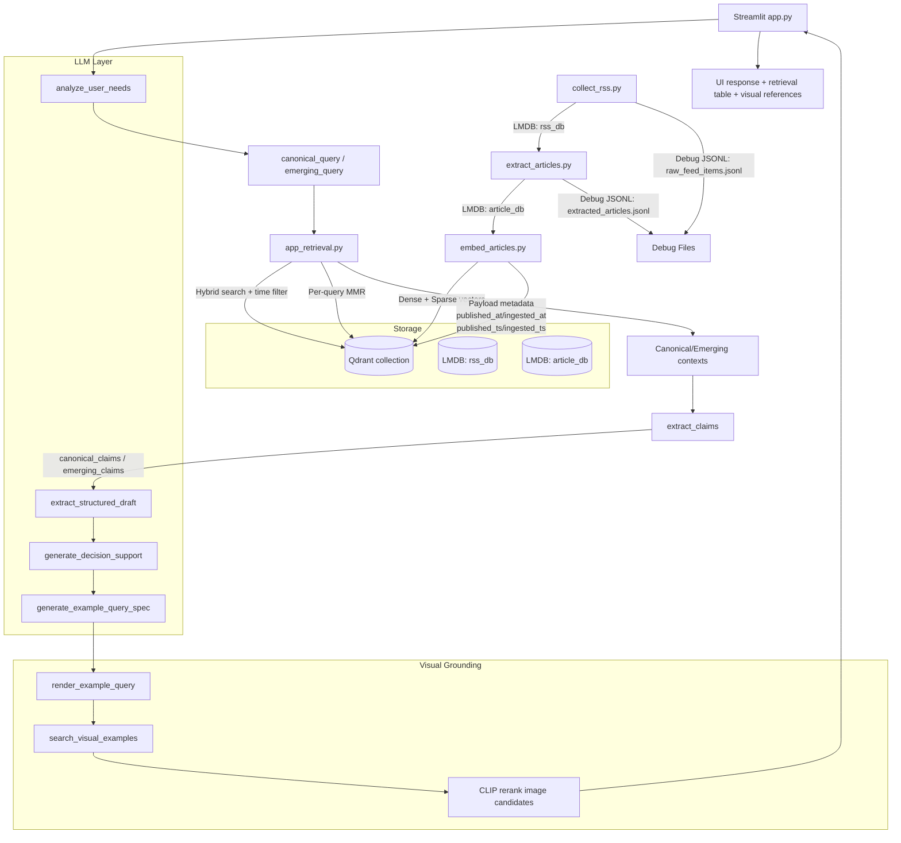

# trend-to-rule

Observable reasoning system for distilling noisy fashion trend narratives into reusable style rules and grounded visual references.

---

## Overview

trend-to-rule is an observable reasoning system for turning noisy multi-source fashion narratives into reusable style rules.

Instead of acting as a summarizer or a hidden recommendation engine, the system separates canonical patterns from emerging signals, extracts structured claims, and synthesizes higher-level rules that help users reason about how style norms evolve.

The goal is not to automate taste or replace human judgment.
The goal is to provide inspectable structure: stable patterns, emerging shifts, explicit trade-offs, and concrete examples that make the distilled rule easier to apply.

The system ingests multi-source articles, performs structured retrieval, separates stable (canonical) patterns from emerging signals, and produces reusable rule-like outputs backed by explicit intermediate artifacts.

LLMs are not treated as autonomous agents here.
They are used as controlled transformation components inside a human-designed pipeline.
The final judgment remains with the user.

This is not just a retrieval tool.
This is not just a summarizer.

The system operates as a staged pipeline:
```
collect → extract → embed → retrieval → claim extraction → structural synthesis → rule generation → visual example retrieval
```

The goal is structural distillation: transforming noisy trend narratives into reusable reasoning artifacts that users can inspect, question, and apply.

### Visual Example Retrieval

The system can optionally attach visual references after rule generation.

This step exists to make distilled rules more concrete without turning the project into a recommendation engine.
Visual examples are treated as explicit example instantiations of a rule, not as hidden recommendations produced by the model.

The pipeline does not send the final answer text directly to image search.
Instead, it first converts the rule into a compact `ExampleQuerySpec`, then renders a search query optimized for image retrieval.

This is intentional.

Explanation terms are not always retrieval terms.
Abstract phrases such as `minimalism`, `sophisticated`, or `quality` may sound appropriate in a written explanation, but they often perform poorly as image-search queries.
For visual retrieval, the system prioritizes concrete wardrobe and context terms such as item, material, silhouette, and usage context.

Image candidates are reranked with a lightweight multilingual CLIP pair:
`sentence-transformers/clip-ViT-B-32-multilingual-v1` embeds the rendered
text query, while `sentence-transformers/clip-ViT-B-32` embeds image
candidates in the same CLIP space. This keeps Japanese and other multilingual
queries usable without replacing the fast image encoder used for visual
similarity.

Example:

`rule -> ExampleQuerySpec -> rendered query -> SearXNG image search -> multilingual CLIP rerank -> visual reference cards`

This keeps the search step:

- explicit
- replaceable
- observable

The core idea is that retrieval itself becomes a reasoning primitive.

The goal is to model how humans derive rules from observed trends.

Visual examples are subordinate to reasoning: they exist to concretize a rule, not to replace the rule with opaque recommendation behavior.

Sample output:

- [examples/sample-output.md](./examples/sample-output.md)

---

## Architecture

The following diagram shows the end-to-end pipeline from RSS ingestion to rule synthesis, followed by optional visual example retrieval.

The pipeline consists of the following stages:

1. RSS collection
2. Article extraction
3. Embedding generation
4. Hybrid retrieval (dense + sparse)
5. Canonical vs Emerging separation
6. Claim extraction
7. Structural synthesis
8. Rule generation
9. Visual example retrieval

Each stage produces explicit intermediate artifacts so the reasoning process remains reproducible and inspectable.



## State Machine Architecture

The Fixed RAR (Retrieve → Analyze → Respond) flow is implemented as a LangGraph state machine in `src/services/chat_workflow.py`. The current graph topology is intentionally **linear**: `extract_claims → extract_structured_draft → generate_decision_support → generate_query → render_image_query → search_images`. The project deliberately prioritizes **deterministic orchestration** before introducing agentic branching, so every chat turn traverses the same ordered nodes and produces the same intermediate artifacts for the same inputs.

Each node consumes and extends a single typed shared state (`AssistantResponseState`, a `TypedDict`). Nodes return only the fields they produce — claims, structured draft, rule, query spec, image query, image results — and downstream nodes read those fields by name. Typing the exchange surface keeps node boundaries explicit and makes each transition auditable.


Checkpoints are persisted to a dedicated Postgres instance (`langgraph-postgres` in `docker-compose.yml`, kept separate from the Langfuse stack) via `PostgresSaver` from `langgraph-checkpoint-postgres`. The checkpointer is attached at compile time when `LANGGRAPH_POSTGRES_URL` is set; otherwise the graph compiles without persistence so local runs without the container still work.

`thread_id` is currently scoped to `chat_id:chat_turn`, intentionally — i.e. one LangGraph thread per chat turn rather than per chat. This keeps each turn starting from a clean initial state (matching the pre-checkpointer behavior) while still persisting every node transition so a specific turn can be inspected later by its `chat_id:chat_turn` key. It also keeps the door open to longer-lived threads in future work without changing today's contract.

Future work — tracked under "Stateful Agentic RAR" — includes: conditional edges between nodes, sufficiency checks (e.g. claim/draft adequacy gates), retrieval loops that re-query when context is insufficient, and longer-lived stateful workflows that resume across turns. These are intentionally out of scope for the current graph; the linear topology exists as a reproducible, inspectable substrate to evolve incrementally rather than a finished agentic system.

## Directory Layout

The codebase is organized to mirror the pipeline described above.

```text
trend-to-rule/
├── .data/
├── docker-compose.yml
├── searxng/
│   └── settings.yml
├── src/
│   ├── app.py
│   ├── Dockerfile
│   ├── .env
│   ├── core/
│   ├── pipeline/
│   ├── prompt_template/
│   ├── retrieval/
│   ├── services/
│   ├── storage/
│   └── ui/
├── pyproject.toml
├── uv.lock
└── README.md
```

- `.data/`: Local runtime artifacts such as LMDB files, JSONL debug outputs, chat state, Qdrant storage, logs, and shared Hugging Face model caches.
- `docker-compose.yml`: Local multi-service runtime for the app, Qdrant, and SearXNG.
- `searxng/`: Local SearXNG configuration used by Docker Compose.
- `src/.env`: Local environment variables for app and pipeline runs.
- `src/Dockerfile`: Container image definition for the Streamlit app.
- `src/core/`: Shared configuration, domain models, and reusable query/text/template helpers.
- `src/pipeline/`: Offline ingestion pipeline stages from RSS collection to extraction and embedding.
- `src/prompt_template/`: Prompt templates used by analysis, claim extraction, synthesis, and image-query generation.
- `src/retrieval/`: Hybrid vector retrieval, MMR reranking, app-facing retrieval formatting, and explicit visual search adapters.
- `src/services/`: LLM client layer, prompt loading, chat-domain functions, workflow orchestration, and image search.
- `src/storage/`: LMDB-backed persistence helpers.
- `src/ui/`: Streamlit UI rendering, session state, and sidebar wiring.
- `src/app.py`: Streamlit application entrypoint.
- `uv.lock`: Locked dependency graph for reproducible `uv` environments.

---
## Motivation

Large Language Models generate plausible summaries, but they often:

- Blur time-series evolution
- Average conflicting viewpoints
- Fail to distinguish stable structure from transient hype
- Lack explicit epistemic boundary control

`trend-to-rule` addresses these limitations by enforcing:

- Explicit canonical vs emerging separation
- Cross-source structural synthesis
- Deterministic output schema
- Reproducible intermediate stages

For users, this means less time spent reading fragmented trend articles and more time spent reasoning with explicit structure: what is stable, what is changing, and what concrete examples instantiate the rule.

---

## Environment Setup (uv)

Install dependencies with:

```bash
uv sync
```

## `.env` Configuration

Create `src/.env` for local runs and Docker Compose `env_file`.

Typical example:

```dotenv
GEMINI_API_KEY=your-gemini-api-key
OPENAI_API_KEY=your-openai-compatible-api-key
OPENAI_BASE_URL=http://localhost:11434/v1
OPENAI_MODEL=gemma4:e4b
OPENAI_REASONING_EFFORT=low

VECTOR_QDRANT_URL=http://localhost:6333
VECTOR_COLLECTION=article_markdown_bge_m3
VECTOR_MODEL_NAME=BAAI/bge-m3
VECTOR_DEVICE=auto
VECTOR_CANDIDATE_K=50
VECTOR_PER_QUERY_TOP_K=5
VECTOR_MMR_DIVERSITY=0.3
SEARXNG_BASE_URL=http://localhost:8008
SEARXNG_IMAGE_FETCH_LIMIT=10
SEARXNG_IMAGE_LIMIT=3
CLIP_TEXT_MODEL_NAME=sentence-transformers/clip-ViT-B-32-multilingual-v1
CLIP_IMAGE_MODEL_NAME=sentence-transformers/clip-ViT-B-32

HF_HOME=.data/huggingface
HF_HUB_CACHE=.data/huggingface/hub
TRANSFORMERS_CACHE=.data/huggingface/hub
SENTENCE_TRANSFORMERS_HOME=.data/huggingface/hub

CHAT_DB_PATH=.data/chat_db
T2R_DEFAULT_WORKSPACE=demo
APP_LOG_LEVEL=INFO

LANGFUSE_PUBLIC_KEY=
LANGFUSE_SECRET_KEY=
LANGFUSE_HOST=
```

Notes:

- `GEMINI_API_KEY`: Used when `services/chat.py` routes requests to Gemini.
- `OPENAI_API_KEY`: Used for OpenAI-compatible endpoints. For some local backends, a dummy value is acceptable.
- `OPENAI_BASE_URL`: Default OpenAI-compatible endpoint. Example: Ollama at `http://localhost:11434/v1`.
- `OPENAI_MODEL`: Default non-Gemini model name.
- `OPENAI_REASONING_EFFORT`: Default reasoning level for non-Gemini models. Supported values are `low`, `medium`, and `high`.
- `VECTOR_QDRANT_URL`: Qdrant endpoint URL (default: `http://localhost:6333`).
- `SEARXNG_BASE_URL`: Optional SearXNG endpoint for app-side web search integration.
- `SEARXNG_IMAGE_FETCH_LIMIT`: Number of raw image candidates fetched from SearXNG before CLIP reranking.
- `SEARXNG_IMAGE_LIMIT`: Number of final image cards shown after CLIP reranking.
- `CLIP_TEXT_MODEL_NAME`: Hugging Face model ID, not a filesystem path. This Sentence Transformers model embeds rendered image-search text queries. The default multilingual CLIP text encoder supports Japanese and other non-English queries.
- `CLIP_IMAGE_MODEL_NAME`: Hugging Face model ID, not a filesystem path. This Sentence Transformers model embeds image candidates in the same CLIP space as the text model.
- `HF_HOME` / `HF_HUB_CACHE` / `TRANSFORMERS_CACHE` / `SENTENCE_TRANSFORMERS_HOME`: Shared Hugging Face cache paths. Keep `TRANSFORMERS_CACHE` and `SENTENCE_TRANSFORMERS_HOME` aligned with `HF_HUB_CACHE` so BGE-M3 and Sentence Transformers CLIP models are stored under the same hub cache root, for example `.data/huggingface/hub/models--sentence-transformers--clip-ViT-B-32`.
- `CHAT_DB_PATH`: LMDB path for chat history and session metadata.
- `T2R_DEFAULT_WORKSPACE`: Default sidebar workspace key for chat history. Use the same workspace key later to reopen that workspace's saved chats.
- `APP_LOG_LEVEL`: Application log level such as `INFO` or `DEBUG`.
- `LANGFUSE_PUBLIC_KEY` / `LANGFUSE_SECRET_KEY` / `LANGFUSE_HOST`: Optional Langfuse tracing. Leave empty to disable. See [docs/langfuse.md](./docs/langfuse.md) for setup and the self-hosted Compose overlay.

SearXNG JSON response example:

```bash
curl "http://localhost:8008/search?q=silicon+valley+fashion&format=json"
```

## Run With Docker Compose

Start the Streamlit app, Qdrant, and SearXNG together with the bundled Compose file:

```bash
docker compose up -d
```

Services will be available at:

- Streamlit app: `http://localhost:8501`
- Qdrant: `http://localhost:6333`
- SearXNG: `http://localhost:8008`

To stop it:

```bash
docker compose down
```

Compose details:

- The app image is built from [`src/Dockerfile`](./src/Dockerfile) using `debian:stable-slim`.
- The app is started with `uv run streamlit run src/app.py`.
- The app connects to Qdrant over the Compose network using `http://qdrant:6333`.
- The app can reach SearXNG over the Compose network using `http://searxng:8080`.
- SearXNG is configured via [`searxng/settings.yml`](./searxng/settings.yml), allows `format=json` responses, and uses a non-default `server.secret_key`.
- Local runtime data is mounted from `.data/` into the container at `/app/.data`, including Qdrant storage, logs, and shared Hugging Face model caches.
- Environment variables are loaded from `src/.env` via `env_file`.

All persistent state lives on the host under `.data/` (git-ignored). Qdrant uses `.data/qdrant/`; the optional Langfuse overlay uses `.data/langfuse/{postgres,clickhouse,clickhouse-logs,valkey,seaweedfs}/`.

For optional Langfuse-backed tracing, start the overlay alongside the base stack:

```bash
docker compose -f docker-compose.yml -f docker-compose.langfuse.yml up -d
```

See [docs/langfuse.md](./docs/langfuse.md) for setup, bootstrap, env vars, and the SeaweedFS-backed self-hosted stack.

---

## Hugging Face Cache Recovery

The app stores downloaded embedding and CLIP models under `.data/huggingface`
so local runs and Docker share the same model files. If a download is
interrupted, vector search can fail with errors such as:

- `No such file or directory: ... .incomplete`
- `Unable to load weights from pytorch checkpoint file ... pytorch_model.bin`

This matters because large local models such as `BAAI/bge-m3` and the CLIP
encoders are part of the local product runtime, not disposable test fixtures.
Keeping the cache under `.data/` prevents repeated downloads across local and
container runs and keeps model state visible alongside the rest of the
self-hosted stack.

Vector search now attempts one automatic recovery: it removes interrupted
downloads or the affected model cache directory, then retries the model load so
Hugging Face can download a clean copy.

If the app is already running and keeps using an old in-process model state,
restart the app container:

```bash
docker compose restart app
```

For manual cleanup, remove only the affected model cache directory:

```bash
rm -rf .data/huggingface/hub/models--BAAI--bge-m3
docker compose restart app
```

The next vector search will redownload `BAAI/bge-m3`, so the first request can
take longer than usual.

---

## collect_rss.py Usage

`collect_rss.py` fetches Google News RSS items for predefined queries and stores normalized records into LMDB + debug JSONL.

### Run

```bash
uv run src/pipeline/collect_rss.py
```

### Resume after interruption

If the process stops due to transient network errors (for example `ConnectionResetError`), resume from the last completed task:

```bash
uv run src/pipeline/collect_rss.py --resume
```

To restart from scratch and clear checkpoint:

```bash
uv run src/pipeline/collect_rss.py --reset-checkpoint
```

### Output

- LMDB: `.data/rss_db`
- Debug JSONL: `.data/raw_feed_items.jsonl`
- Checkpoint: `.data/collect_rss_checkpoint.json`
- Log: `.data/logs/collect_rss.log`

### Notes

- Current query list and per-query fetch size (`n=50`) are defined in code (`main()`).
- Records are deduplicated by `dedupe_key` when writing to LMDB.
- Checkpoint is updated after each successful task; `--resume` skips tasks up to the saved index.
- You can override checkpoint path with `--checkpoint-path`.
- Logs are rotated daily and kept for 5 days. You can override the log path with `--log-path`.

---

## extract_articles.py Usage

`extract_articles.py` reads RSS records from LMDB, resolves article pages, converts article body to Markdown, and writes results to LMDB + debug JSONL.

### Run

```bash
uv run src/pipeline/extract_articles.py
```

### Typical example

```bash
uv run src/pipeline/extract_articles.py \
  --input-lmdb .data/rss_db \
  --output-lmdb .data/article_db \
  --debug-jsonl .data/extracted_articles.jsonl \
  --interval 1.5
```

### Main options

- `--input-lmdb`: Input RSS LMDB path (default: `.data/rss_db`)
- `--output-lmdb`: Output extracted LMDB path (default: `.data/article_db`)
- `--debug-jsonl`: Debug JSONL append path (default: `.data/extracted_articles.jsonl`)
- `--limit`: Max records to process (`0` means all)
- `--interval`: Sleep seconds per record request
- `--no-readability`: Disable readability-based extraction
- `--only-new`: Skip records whose `dedupe_key` already exists in output LMDB
- `--log-path`: Log file path (default: `.data/logs/extract_articles.log`)

### Notes

- Output Markdown includes frontmatter metadata (e.g. `source_url`, `resolved_url`, `published_at`, `locale`, `country`, `word_count`, `section_count`).
- LMDB and JSONL are written per record.
- Logs are written to `.data/logs/extract_articles.log`, rotated daily, and kept for 5 days.

---

## embed_articles.py Usage

`embed_articles.py` reads extracted article markdown from LMDB, creates dense+sparse embeddings with `bge-m3`, and upserts chunk vectors into Qdrant.

### Run

```bash
uv run src/pipeline/embed_articles.py
```

### Example: Docker Compose Qdrant

```bash
uv run src/pipeline/embed_articles.py \
  --input-lmdb .data/article_db \
  --collection article_markdown_bge_m3 \
  --qdrant-url http://localhost:6333 \
  --batch-size 32 \
  --device auto \
  --interval 0.5 \
  --recreate
```

### Main options

- `--input-lmdb`: Input extracted LMDB path (default: `.data/article_db`)
- `--qdrant-url`: Qdrant endpoint URL (default: `http://localhost:6333`)
- `--qdrant-api-key`: Qdrant API key
- `--collection`: Target Qdrant collection name
- `--model-name`: Embedding model name (default: `BAAI/bge-m3`)
- `--batch-size`: Embedding batch size
- `--limit`: Max records to process (`0` means all)
- `--interval`: Sleep seconds between each record processing
- `--recreate`: Drop and recreate collection before ingest
- `--only-new`: Embed only chunks not already present in Qdrant
- `--update-payload-only`: Update payload only (no re-embedding, no vector overwrite)
- `--log-path`: Log file path (default: `.data/logs/embed_articles.log`)


### Notes

- Requires Qdrant running via Docker Compose. Use `--qdrant-url http://localhost:6333` (default).
- Payload includes metadata such as `published_ts` and `ingested_ts` (Unix time).
- Logs are written to `.data/logs/embed_articles.log`, rotated daily, and kept for 5 days.

---

## app.py Usage

Launch the Streamlit app with:

```bash
uv run streamlit run src/app.py
```

---

## Retrieval Design Matters: A Comparison

This section demonstrates how retrieval strategy fundamentally changes output quality.

We compare two approaches:

1. **Baseline Retrieval** – Direct vector search using the raw user prompt.
2. **Structured Retrieval** – Separate hybrid searches for canonical and emerging patterns.

### 1) Baseline: User Prompt -> Vector Search -> Synthesis

**User Prompt**
> "Tell me about fashion trends in Silicon Valley."

#### Retrieval Strategy

- Single vector query using the raw user prompt.
- Hybrid search (dense + sparse) + MMR
- Top-N results passed directly to synthesis.

#### Observed Output Characteristics

- Blends historical norms and recent shifts together.
- Tends toward summarization rather than structural separation.
- Canonical and emerging patterns are often mixed.
- Conflicts are averaged out instead of exposed.
- Output resembles a blog-style overview.

#### Example Pattern

- "Minimalist tech uniforms"
- "Vintage denim replacing chinos"
- "Quiet luxury trend"

These elements are described together without clear temporal or structural distinction.

#### Limitation

The model performs a semantic average over retrieved content.  
No explicit separation of time, dominance, or structural shift occurs.

**Result:** Readable, but structurally weak.

### 2) Structured Retrieval: Canonical vs Emerging Separation

Instead of retrieving with the raw user prompt:

1. Generate two structurally distinct queries:
   - `canonical_query`
   - `emerging_query`
2. Perform hybrid search independently for each.
   - `emerging`: `published_ts >= now - 180d`
   - `canonical`: `published_ts < now - 180d`
3. Apply MMR within each result set.
4. Keep canonical and emerging result sets independent for synthesis context.

#### Canonical Query (Example)
`tech industry dress code evolution Bay Area professional norms`

#### Emerging Query (Example)
`Bay Area workplace style shift 2024 adoption signaling changes`

#### Observed Output Characteristics

- Canonical contains **pre-shift baseline patterns**:
  - Minimalist tech uniform
  - Normcore aesthetic
  - Traditional office wear (chinos, dress trousers)
- Emerging contains **post-shift change signals**:
  - Vintage denim normalization
  - Quiet luxury among tech elites
  - Generational silhouette shifts
- Conflicts are explicit:
  - Minimalist anti-fashion vs quiet luxury sophistication
  - Chinos -> vintage denim replacement
- Gaps are surfaced rather than ignored.

**Result:** Structured, temporally separated, and analytically useful.

### Key Insight

The model did not change.  
The improvement comes from encoding structural intent into retrieval rather than relying on the model to infer it.

The same principle also applies to visual-example retrieval: the system does not pass an abstract style explanation directly into image search, but instead translates rules into a compact query specification and renders search terms that favor concrete wearable/contextual signals over broad moodboard language.

Output structure is primarily influenced by retrieval design rather than model capability.

### Architectural Implication

Standard RAG: `retrieve -> generate`  
`trend-to-rule`: `separate -> retrieve -> filter(time) -> diversify(MMR) -> structure -> synthesize`

Retrieval becomes an active reasoning component rather than a passive context provider.

### Why This Matters

This approach enables:

- Structural abstraction of trends
- Explicit time-evolution modeling
- Conflict detection instead of averaging
- Reusable rule extraction

It moves beyond traditional RAG into structured reasoning augmentation.

---

## Explicit Search Over Hidden Grounding

The project prefers explicit, replaceable search components over model-internal grounding.
That applies not only to article retrieval but also to visual-example retrieval.
Visual references are attached after the final structured answer so that examples remain subordinate to reasoning rather than replacing it.

External search is treated as infrastructure:

- queries are generated explicitly
- search backends are replaceable
- image candidates are reranked explicitly with CLIP similarity
- retrieved examples remain observable to the user

This makes it easier to inspect failures, tune query rendering, and avoid vendor-locked hidden retrieval behavior.

## Future Work

Planned improvements include:

- Better claim-level extraction precision and robustness
- Improved retrieval ranking for canonical vs emerging separation
- Better visual grounding evaluation and query rendering for example retrieval
- Observability-driven iteration using Langfuse traces and structured intermediate artifacts
- A separate generalized evaluation repository for benchmarking structural reasoning against simpler retrieval baselines

These additions aim to strengthen both the product value of the system and the clarity of its reasoning process.

---

## Model Handling

`create()` in `src/services/llm_client.py` routes all LLM calls through [Pydantic AI](https://ai.pydantic.dev/), regardless of whether the backend is Gemini or an OpenAI-compatible endpoint.

The architecture is intentionally model-agnostic. Lightweight models can be used for most stages of the pipeline to keep latency low, while stronger reasoning models can be swapped into structural synthesis stages if deeper reasoning is required.

### Backend Selection

Selection is based on the `model` string passed to `create()`:

- If `model` contains `gemini`: calls are routed through `GoogleModel` + `GoogleProvider` (Gemini API key auth).
- Otherwise: calls are routed through `OpenAIModel` + `OpenAIProvider` (OpenAI-compatible endpoint, e.g. Ollama).

### Structured vs Unstructured Output

- When `response_model` is supplied, Pydantic AI's `output_type` enforces the schema and returns a typed Pydantic model instance directly.
- When `response_model` is omitted, `create()` returns a `SimpleNamespace` with a `.text` attribute containing the plain-text response string.

### Thinking / Reasoning Configuration

- **Gemini**: thinking budget is mapped from `reasoning_effort` via `GoogleModelSettings.google_thinking_config` with budgets of 512 / 1024 / 2048 tokens for `low` / `medium` / `high`.
- **OpenAI-compatible**: `reasoning_effort` is forwarded as `OpenAIModelSettings.openai_reasoning_effort`. If the model rejects this parameter (HTTP 400), the call is automatically retried without it, and that model name is cached in-process so subsequent calls skip `reasoning_effort` from the first attempt.

### Langfuse Tracing

Langfuse `generation` spans are written by the existing `tracing` helpers (`@tracing.observe`, `tracing.update_current_generation`). Pydantic AI's own auto-instrumentation (`Agent.instrument_all()`) is intentionally not enabled here to avoid duplicate spans under the existing `chat_turn` trace structure.

### OpenAI-Compatible Defaults

- `OPENAI_BASE_URL`: `http://localhost:11434/v1`
- `OPENAI_MODEL`: `gemma4:e4b`
- `OPENAI_REASONING_EFFORT`: `low`

`create()` also supports the following runtime parameters (with defaults):

- `temperature=0.2`
- `top_p=0.6`
- `seed=42`
- `reasoning_effort="low"`

---

## Observability with Langfuse

LLM calls and pipeline stages are optionally traced via [Langfuse](https://langfuse.com/). Tracing activates automatically when both `LANGFUSE_PUBLIC_KEY` and `LANGFUSE_SECRET_KEY` are present in `src/.env`; otherwise `src/services/tracing.py` degrades to a no-op.

Each Streamlit chat turn is captured as a single `chat_turn` trace (tagged with the workspace key, chat session id, workflow version, and detected vertical) with nested spans for `analyze_user_needs`, `retrieve_supporting_context`, `extract_claims`, `extract_structured_draft`, `generate_decision_support`, `generate_query`, and `generate_chat_title`.

LLM calls in `services/llm_client.py` are recorded as `generation` spans carrying the model name, input messages, output, token usage (`input` / `output` / `total`), and sampling config (`temperature`, `top_p`, `seed`, `reasoning_effort`).

For self-hosting the Langfuse stack via Compose overlay, see [docs/langfuse.md](./docs/langfuse.md).

---

## License

This project is licensed under the MIT License.

This project uses third-party libraries, each of which is subject to its own license.
